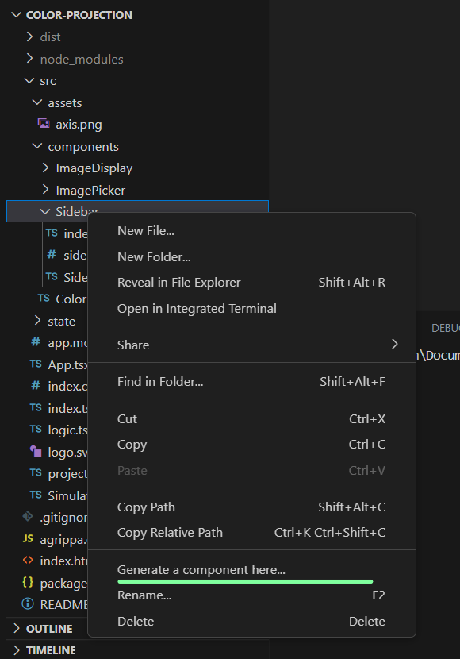

# Agrippa for Visual Studio Code

This extension integrates [agrippa](https://agrippa.dev)'s component generation capabilities into Visual Studio Code's UI.

## Features

This extension allow creating a new component in a click, by right clicking a file or directory in the file explorer:

Clicking this new option will prompt you to pick a name to your new component, after which it will be created and opened in the editor for you 🎉

## Requirements

Generating a component requires an Agrippa config file (e.g. `agrippa.config.mjs`) to be present somewhere in your workplace - typically at your project's root.
When present, the file explorer's context menu (brought up by right clicking a file or directory) should have a new option: "*Generate a component here...*"  
once clicked, you'll be prompted to give a name to the new component, and then it will be generated.

## Known Issues

This extension is in early stages of development and may produce unstable results; use with caution.

Currently in the works: an `init` command for creating a plugin and the ability to customize options per-component (similar to the command line).

## Release Notes

### 1.0.0

Initial release.
